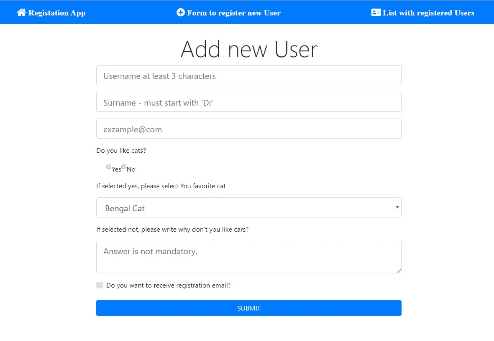
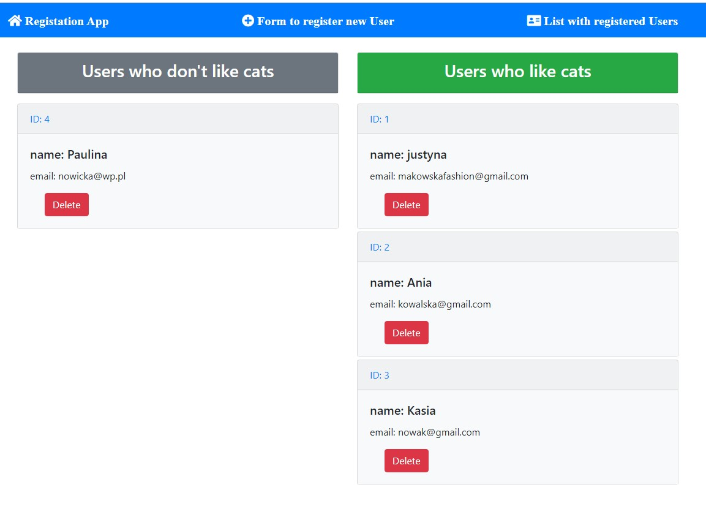
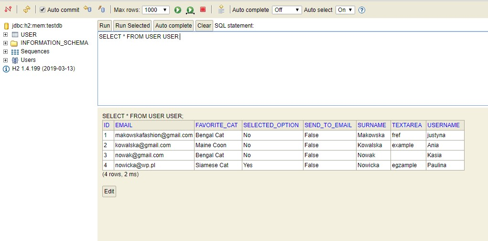
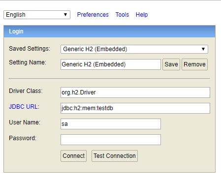

# User Form App with React, Redux and SpringBoot

## Table of contents
* [General info](#general-info)
* [Technologies](#technologies)
* [Setup](#setup)

## General info
Full Stack app with frontend and backend boards.

#### Frontend: 
* Application with a form.
* Subpages: Register new user, List showing all registered users.




#### Backend:
* The backend uses Java, based on SpringBoot framework.
* The database is integrated with the application H2.
* Registered user's data are stored on backend's side and read from there.
* Deleted user's data removed on backend's side.




	
## Technologies
Project is created with:
* React App
* Spring Boot
	
## Setup

#### Backend:
* To run this project, install it locally using IntelliJ IDEA <https://www.jetbrains.com/idea/>
* Open backend's folder in IntelliJ IDEA
* Run UserFormApplication
* Open on your browser: http://localhost:8080/h2-console


#### Frontend: 
To run this project, install it locally using npm:
```
$ git clone https://github.com/Bumilka/UserForm-React-Redux-SpringBoot.git
$ cd UserForm-React-Redux-SpringBoot
$ npm install
$ code .
$ npm start
```